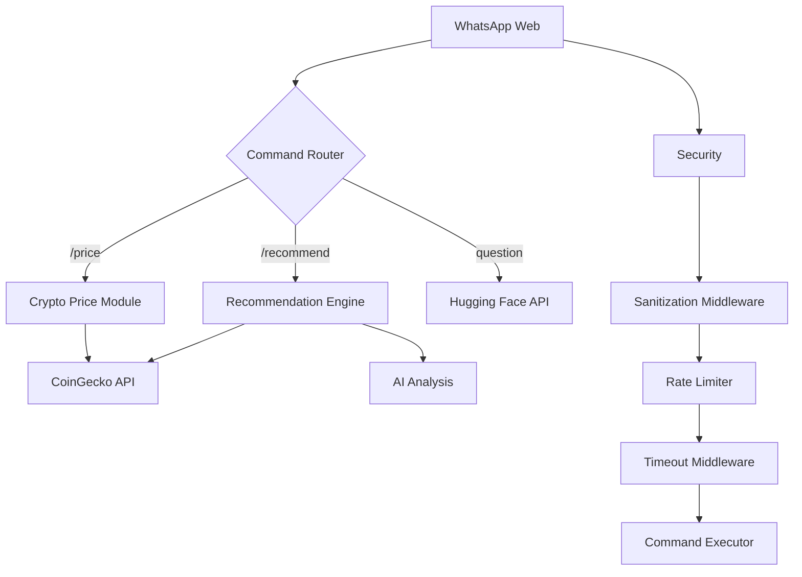

# BlockMind 🤖

**AI-Powered WhatsApp Assistant with Cryptocurrency Insights**

[](LICENSE)
[](https://go.dev/)
[](https://huggingface.co/)
[](https://www.coingecko.com/)

---

## Overview

BlockMind is a secure, production-ready WhatsApp chatbot that combines:

- **AI-Powered Q&A**: Precise answers using Hugging Face's NLP models
- **Cryptocurrency Tools**: Real-time price checks and investment recommendations
- **Multilingual Support**: English and Spanish commands
- **Rate Limiting & Security**: Input sanitization and abuse prevention

---

## Features ✨

| Command               | Example                 | Description                                  |
| --------------------- | ----------------------- | -------------------------------------------- |
| **General Q&A**       | `What is blockchain?`   | AI answers with strict format rules          |
| **Crypto Price**      | `/price Bitcoin`        | Real-time price lookup via CoinGecko         |
| **Price in Currency** | `/price Bitcoin in EUR` | Get prices in specific currencies            |
| **Recommendations**   | `/recommend Ethereum`   | Get investment recommendations with analysis |
| **Help**              | `/help`                 | Multilingual command list                    |
| **Security**          | Automatic sanitization  | Blocks scripts, SQLi, and malicious URLs     |

---

## Tech Stack 🛠

- **Core**: Go 1.24
- **AI**: Hugging Face Inference API with structured prompts
- **Crypto Data**: CoinGecko API with market analysis
- **Messaging**: `go.mau.fi/whatsmeow` (WhatsApp Web API)
- **Security**: Input sanitization, rate limiting, SQL injection protection
- **Persistence**: SQLite for WhatsApp session storage
- **Configuration**: Environment variables via `.env`

---

## Setup Instructions 🚀

### 1. Prerequisites

```bash
# Install dependencies
go install github.com/mattn/go-sqlite3@latest
go install go.mau.fi/whatsmeow@latest
go install github.com/joho/godotenv
```

### 2. Configuration

Create `.env` file:

```env
# Required settings
HUGGINGFACE_API_KEY=hf_your_key
COINGECKO_API_KEY=cg_your_key
COINGECKO_API_URL=https://api.coingecko.com/api/v3/
HUGGINGFACE_MODEL=meta-llama/Llama-3.2-3B-Instruct
HUGGINGFACE_BASE_URL=https://router.huggingface.co/hf-inference/models/

# Optional settings
AI_TIMEOUT=20
AI_MAX_TOKENS=250
AI_TEMPERATURE=0.5
WHATSAPP_DB_PATH=file:whatsapp.db?_foreign_keys=on
WHATSAPP_LOG_LEVEL="INFO"
RATE_LIMIT=5
RATE_LIMIT_PERIOD=60
COMMAND_TIMEOUT=25
DEBUG=false
```

### 3. Run the Bot

```bash
go run cmd/server/main.go
```

**First-time setup**:

1. Scan the QR code printed in terminal
2. Send `/help` to see commands

---

## Security Features 🔒

- **Input Sanitization**:
  - Blocks script tags and SQL injection attempts
  - Limits input length to 1,000 characters
  - Filters Unicode homoglyph attacks
- **Rate Limiting**:
  - 5 requests/minute per user (configurable)
- **Timeouts**:
  - 20s for AI requests
  - 25s for command processing

---

## Cryptocurrency Features 📈

BlockMind offers comprehensive cryptocurrency insights:

- **Real-time Prices**: Get current prices in multiple currencies
- **Market Data**: Access market cap, volume, and price changes
- **Technical Analysis**: View sentiment indicators and historical trends
- **AI-Powered Recommendations**: Get investment suggestions based on market data
- **Multi-currency Support**: Check prices in USD, EUR, GBP and more

---

## Architecture Overview



---

## Disclaimer ⚠️

- AI responses depend on Hugging Face model capabilities
- Cryptocurrency data is provided by CoinGecko API
- Not financial advice - recommendations are for educational purposes only
