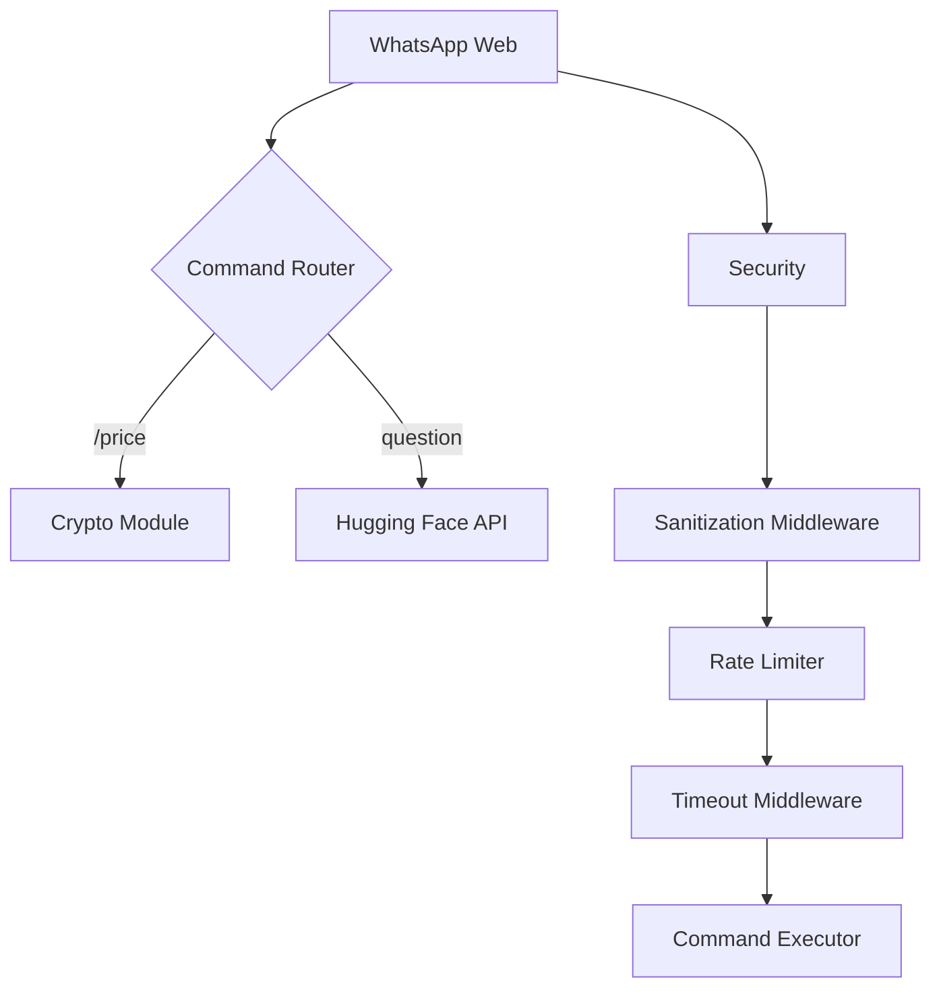

# BlockMind 🤖

**AI-Powered WhatsApp Assistant with Cryptocurrency Insights**

[](LICENSE)
[](https://go.dev/)
[](https://huggingface.co/)

---

## Overview

BlockMind is a secure, production-ready WhatsApp chatbot that combines:

- **AI-Powered Q&A**: Precise answers using Hugging Face's NLP
- **Cryptocurrency Tools**: Price checks and investment recommendations
- **Multilingual Support**: English and Spanish commands
- **Rate Limiting & Security**: Input sanitization and abuse prevention

---

## Features ✨

| Command          | Example                | Description                              |
| ---------------- | ---------------------- | ---------------------------------------- |
| **General Q&A**  | `What is blockchain?`  | AI answers with strict format rules      |
| **Crypto Price** | `/price Bitcoin`       | Real-time price lookup (placeholder)     |
| **Help**         | `/help`                | Multilingual command list                |
| **Security**     | Automatic sanitization | Blocks scripts, SQLi, and malicious URLs |

---

## Tech Stack 🛠

- **Core**: Go 1.24
- **AI**: Hugging Face Inference API with structured prompts
- **Messaging**: `go.mau.fi/whatsmeow` (WhatsApp Web API)
- **Security**: Input sanitization, rate limiting, SQL injection protection
- **Persistence**: SQLite for WhatsApp session storage
- **Configuration**: Environment variables via `.env`

---

## Setup Instructions 🚀

### 1. Prerequisites

```bash
# Install dependencies
go install github.com/mattn/go-sqlite3@latest
go install go.mau.fi/whatsmeow@latest
go install github.com/joho/godotenv
```

### 2. Configuration

Create `.env` file:

```env
HUGGINGFACE_API_KEY=hf_your_key
HUGGINGFACE_MODEL=meta-llama/Llama-3.2-3B-Instruct
WHATSAPP_DB_PATH=file:whatsapp.db?_foreign_keys=on
AI_TIMEOUT=20
AI_MAX_TOKENS=250
AI_TEMPERATURE=0.0
WHATSAPP_LOG_LEVEL="INFO"
RATE_LIMIT=5
RATE_LIMIT_PERIOD=60
COMMAND_TIMEOUT=25
DEBUG=false
```

### 3. Run the Bot

```bash
go run cmd/server/main.go
```

**First-time setup**:

1. Scan the QR code printed in terminal
2. Send `/help` to see commands

---

## Security Features 🔒

- **Input Sanitization**:
  - Blocks script tags and SQL injection attempts
  - Limits input length to 1,000 characters
  - Filters Unicode homoglyph attacks
- **Rate Limiting**:
  - 5 requests/minute per user (configurable)
- **Timeouts**:
  - 20s for AI requests
  - 25s for command processing

---

## Architecture Overview



---

## Disclaimer ⚠️

- Cryptocurrency data is currently placeholder - requires CoinGecko API integration
- AI responses depend on Hugging Face model capabilities
- Not financial advice - recommendations are for educational purposes
